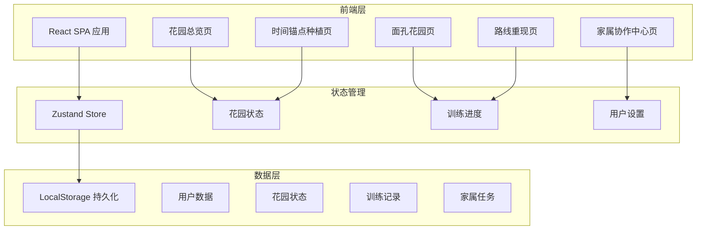

## 1. 架构设计



## 2. 技术说明

- **前端框架**：React@18 + TypeScript
- **样式方案**：Tailwind CSS@3
- **构建工具**：Vite
- **动画库**：Framer Motion
- **3D渲染**：Three.js + @react-three/fiber + @react-three/drei（花园3D场景）
- **状态管理**：Zustand（轻量级状态管理，适合本应用规模）
- **后端服务**：无（纯前端应用，数据存储于LocalStorage）
- **数据存储**：LocalStorage + Zustand persist middleware

## 3. 路由定义

| 路由 | 用途 |
|------|------|
| `/` | 首页花园总览，展示个人花园、今日任务、日历森林 |
| `/plant` | 时间锚点种植页，每日种树及日期记忆训练 |
| `/faces` | 面孔花园页，家人面孔识别训练 |
| `/route` | 路线重现页，虚拟社区路线行走训练 |
| `/family` | 家属协作中心，任务布置与花园同步 |

## 4. 数据模型

### 4.1 数据模型定义

```mermaid
erDiagram
    "User" ||--o{ "Tree" : "plants"
    "User" ||--o{ "FaceRecord" : "has"
    "User" ||--o{ "RouteProgress" : "walks"
    "User" ||--o{ "FamilyTask" : "receives"
    "User" {
        string "id PK"
        string "name"
        string "role"
        string "avatar"
        number "fontSize"
        boolean "highContrast"
    }
    "Tree" {
        string "id PK"
        string "userId FK"
        string "date"
        number "growthStage"
        number "memoryStability"
        boolean "watered"
        boolean "fertilized"
        boolean "sunlight"
    }
    "FaceRecord" {
        string "id PK"
        string "userId FK"
        string "photoUrl"
        string "name"
        string "relation"
        number "difficulty"
        number "successCount"
        number "lastPracticed"
    }
    "RouteProgress" {
        string "id PK"
        string "userId FK"
        string "routeName"
        number "currentNode"
        number "completedNodes"
        number "totalNodes"
        number "lastWalked"
    }
    "FamilyTask" {
        string "id PK"
        string "userId FK"
        string "familyMemberId"
        string "taskType"
        string "message"
        boolean "completed"
        string "createdAt"
    }
    "GardenState" {
        string "id PK"
        string "userId FK"
        number "totalFlowers"
        number "totalTrees"
        number "streakDays"
        string "lastActiveDate"
    }
    "User" ||--o| "GardenState" : "owns"
```

### 4.2 数据定义

```typescript
interface User {
  id: string;
  name: string;
  role: "elder" | "family";
  avatar: string;
  settings: {
    fontSize: "normal" | "large" | "xlarge";
    highContrast: boolean;
  };
}

interface Tree {
  id: string;
  userId: string;
  date: string;
  growthStage: number;
  memoryStability: number;
  actions: {
    watered: boolean;
    fertilized: boolean;
    sunlight: boolean;
  };
}

interface FaceRecord {
  id: string;
  userId: string;
  photoUrl: string;
  name: string;
  relation: string;
  difficulty: number;
  successCount: number;
  lastPracticed: string;
}

interface RouteNode {
  id: string;
  name: string;
  description: string;
  x: number;
  y: number;
  icon: string;
}

interface RouteProgress {
  id: string;
  userId: string;
  routeName: string;
  nodes: RouteNode[];
  currentNodeIndex: number;
  lastWalked: string;
}

interface FamilyTask {
  id: string;
  userId: string;
  familyMemberName: string;
  taskType: "plant" | "face" | "route";
  message: string;
  completed: boolean;
  createdAt: string;
}

interface GardenState {
  id: string;
  userId: string;
  totalFlowers: number;
  totalTrees: number;
  streakDays: number;
  lastActiveDate: string;
  flowers: Array<{
    type: string;
    x: number;
    y: number;
    color: string;
    bloomDate: string;
  }>;
}
```
